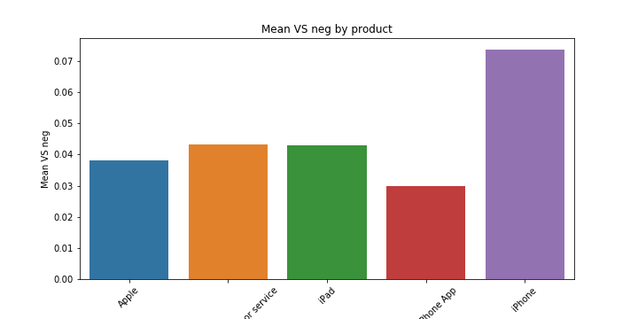

# Sentiment Analysis of Technology Tweets from South by Southwest

**Authors**: Amelia Dahm, Eric Roberts

## Overview

## Business Problem

Social media, in particular Twitter, has become the defacto forum in which consumers voice praise or criticism for products and events.  It is becoming increasingly important for companies to identify both positive and negative tweets in real-time in order to respond to criticism and highlight praise.  However, given the volume of tweets this is a neigh impossible task to accomplish manually. Therefore this project aimed to build a prediction model to identify positive and negative tweets to allow companies to identify them in real-time. Not only is it critical to identify the sentiment of tweets, but we also want to understand the content of these tweets to identify patterns, if any, in the responses.  Therefore in addition to buildng a prediction model, we perform a content analysis on our set of tweets to demonstrate the utility for understanding patterns in our data.

As a test case we build our model using tweets regarding technology from the South by Southwest (SXSW) festival; large festivals are huge opportunities for companies to showcase their products and generate sales.  After showcasing a new product it is critical companies know how their product is being received.  Similarly, technology festivals themselves are huge businesses and maintaining their relevance requires understanding what worked well as well as responding to participant criticism.  This makes this an ideal test case with many potential stake holders.

***
Goals:
* Build a prediction model for the sentiment of tweets.
* Perform a content analysis of tweets.
***

## Data

The data being used for this project comes from [CrowdFlower](https://data.world/crowdflower/brands-and-product-emotions).  Human reviewers, rated 9093 tweets as having positive, negative, neutral or unknown sentiment as well as tagging which brand or product was the target of the tweet.

## Methods

Tweets were tokenized, stopwords and punctuation were removed, and words were lemmatized using the appropriate libraries in NLTK with the following customizations: 

* We refined our RegExp tokenizer as the analysis proceeded to capture important content, e.g., iPad 2 as a distinct concept from iPad.
* Abbreviations common in tweets were added to the list of stop words, e.g., 'u', 'w', and '2' were removed as we assumed they represented 'you', 'with' and 'to/too/two'.

Exploratory data analysis included graphing the distribution of labels and products in the dataset overall and by valence of the product.  Further we tabulated the word frequecy overall, by product and by valence.

Our models included the following features:
* TI-IDF uni- and bi-gram scores
* Sentiment and polarity scores from the TextBlobs library
* Positive, neutral, negative and composite scores from the VaderSentiment library
#### * Scores from the other libraries

We built a random forrest classifer, using grid search to tune the following hyperparameters: the number of estimators, max number of features, maximum depth, and splitting criterion.  To combat class imbalance we upsampled the negative, positive and unknown labels to be equal in size to the neutral label. Our final model predicted labels with 92% accuracy.

## Results

Figure 1 shows the distribution of tweets by brand overall.  The majority of tweets were not specifically directed at a brand (n=5801) but of those that were, Apple was tweeted about (n=2409) more than 2x as often as Google (n=723) and Android had the fewest tweets (n=159). 

### Figure 1

Figure 2 shows the distribution of the VADER Sentiment scores by brand.  The majority sentiment for all tweets was neutral.  Android's positivity score was the highest and Apple's negativity score was the lowest. 

### Figure 2

We assessed whether there was a difference in negative sentiment by categories of apple products (figure 3) and found that iphones had the highest mean score on the negativity scale.

### Figure 3

We assessed the word frequency among the highly positive tweets (VADER sentiment positivity scale >= 0.5) (figure 4) and we compared this to the word frequency among the highly negative tweets (VADER sentiment negativity scale >= 0.5) (figure 5).  In both sets of tweets SXSW and mention appear frequently.

Overall - assuming SXSW and mention were used in all tweets about the festival
negative >= 0.5. Looks like people were complaining about hotspots/internet, check-in, tool/mobile(maybe the mobile site or another tool), restaurants, experimenting/tinkering (I think they wanted to play with the toys and didn't get to). "viewed, explorer and mayer" were highly frequent. Unsure what these refer to.
positive >= 0.6. 'Link' and 'rt' are high - assuming people are linking to or retweeting new products they like. I would infer general excitment for the various products from "being in 'line' 'today'/'tomorrow' 'launch' and the product names". And general thanks/congrats for "seeing/meeting" someone potentially at a 'party'

### Figure 4

### Figure 5

